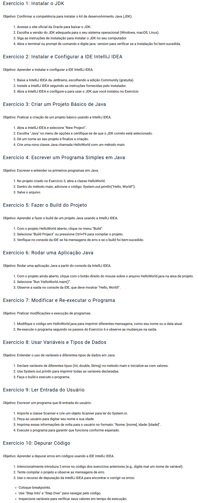

# TP1 - Questões
Modo de Uso:
- Há um arquivo src>main>java>Start.java, que é o arquivo principal do projeto.
- Para executar o código, basta abrir o arquivo Start.java e descomentar o exercício que deseja executar.

